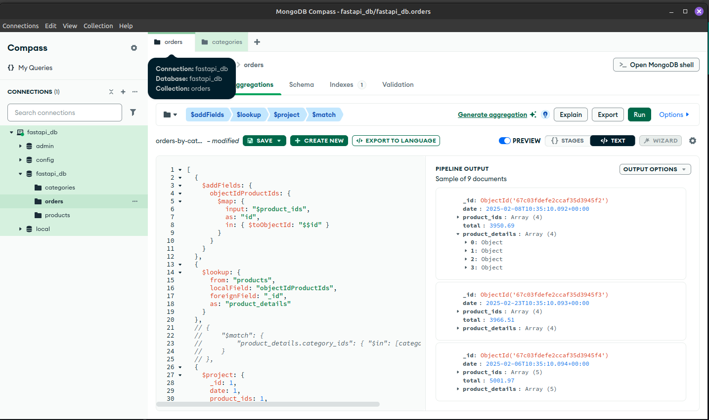
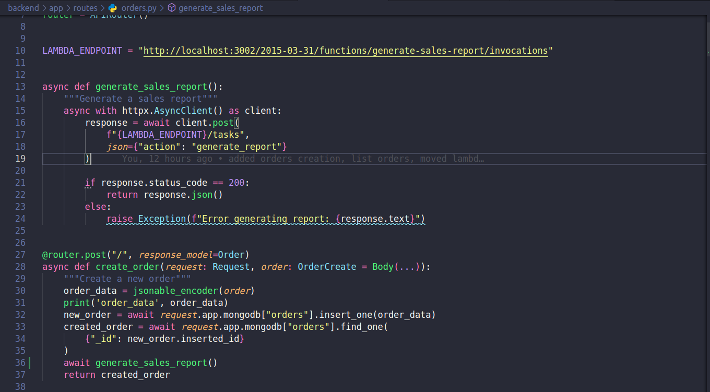
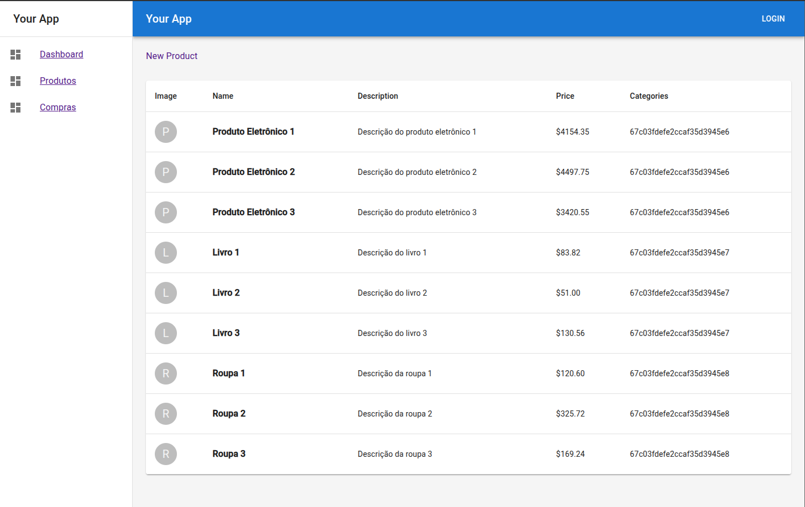
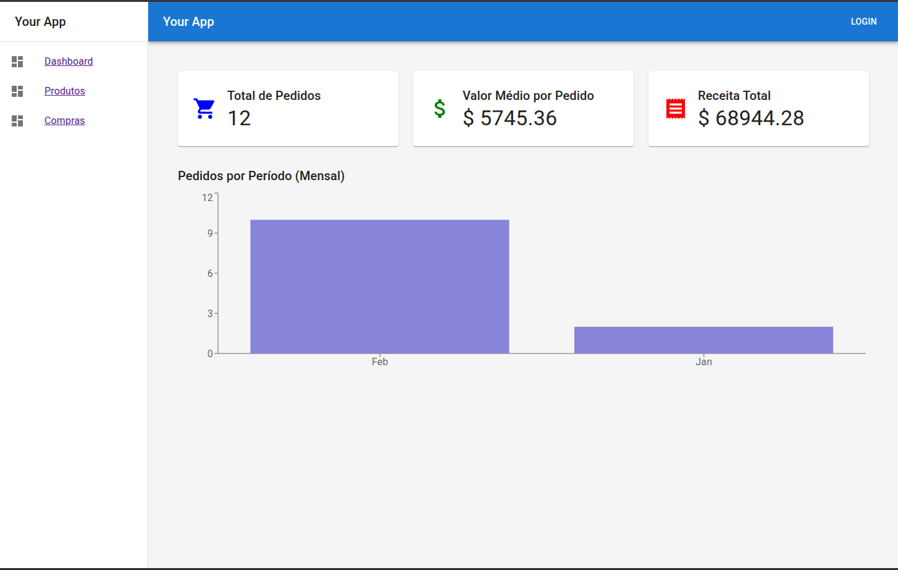
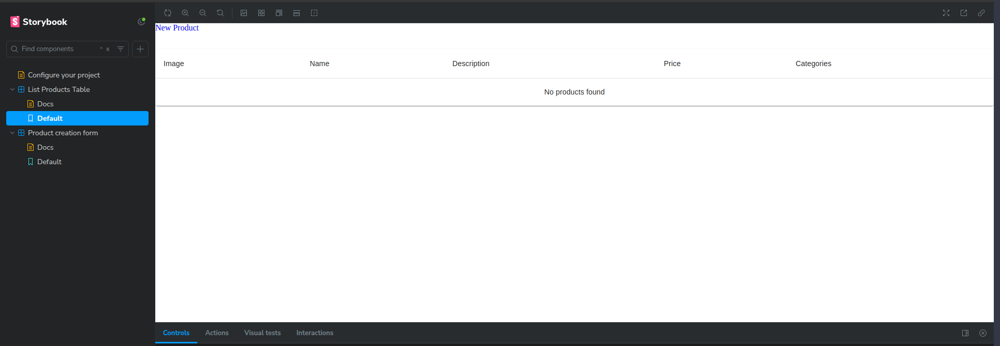
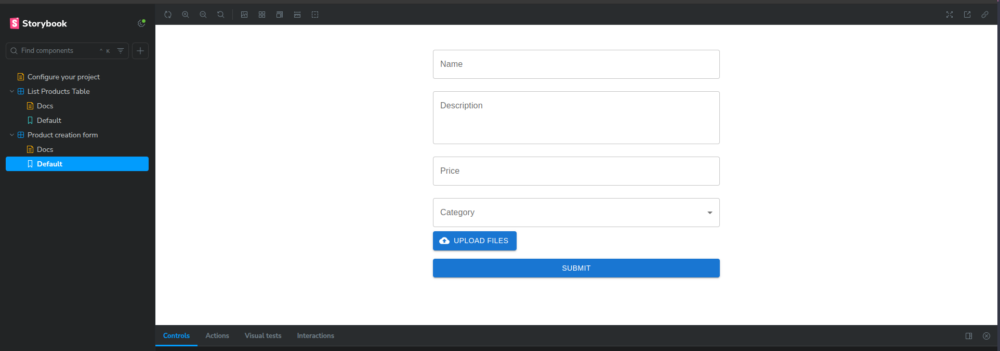
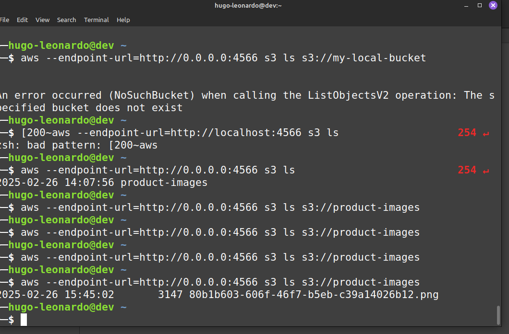
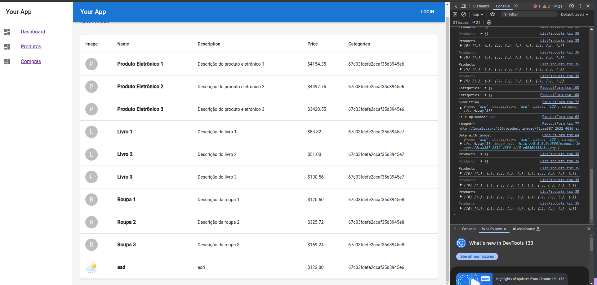

# Fullstack project

É necessário ter aws, aws-sam-cli, docker, docker-compose, node.js, python 3 instalados no seu computador para executar a aplicação.

## Variáveis de ambiente

```
MONGO_URI=mongodb://mongo:27017
DB_NAME=fastapi_db
```

## Como executar a aplicação

A aplicação inteira está separada em containers do Docker.

Para executar todos os containeres:

    ```bash
        docker-compose up --build
    ```

- Frontend está em [http://0.0.0.0:3000/](http://0.0.0.0:3000/)

- Frontend em localhost porta 3001:
     ```bash
        cd frontend
        npm start
     ```

- Storybook:
    ```bash
        cd frontend
        npm run storybook
    ```

- Backend está em `http://0.0.0.0:8000/api` e [http://0.0.0.0:8000/docs](http://0.0.0.0:8000/docs)

- Localstack [http://0.0.0.0:4566/](http://0.0.0.0:4566/)

- MongoDB [http://0.0.0.0:27017/](http://0.0.0.0:27017/)

- Lambda será executado separadamente, será demonstrado a seguir com as outras features

## Requisitos

Desafio Full Stack
Objetivo Geral​
Desenvolver uma aplicação full stack que integre FastAPI, MongoDB, ReactJS e AWS (com
LocalStack para S3). Use Python no backend, Serverless Framework (para funções Lambda)
e Docker para containerização.

1. Backend (FastAPI + MongoDB)
1.1. Entidades
- [X] As entidades permanecem as mesmas, mas use modelos Pydantic para validação:
- [X] 1.1.1. Product - id (string ou ObjectId) - name (string) - description (string) - price (number) - category_ids (lista de IDs) (relação many-to-many com Category) - image_url (string) – URL da imagem no S3
- [X] 1.1.2. Category - id (string ou ObjectId) - name (string)
- [X] 1.1.3. Order- id (string ou ObjectId) - date (Date) - product_ids (lista de IDs de Product) - total (number)

Observação: O relacionamento entre Product e Category é many-to-many, permitindo que cada Product pertença a várias Categories e vice-versa.

1.2. Endpoints
1.2.1. CRUD para cada entidade:
- [X] ​Product: criar, listar, atualizar, deletar.
- [X] ​Category: criar, listar, atualizar, deletar.
- [X] ​Order: criar, listar, atualizar, deletar.
  
1.2.2. Dashboard: 
- [X] Exibir dados agregados de vendas com filtros por categoria, produto e período (implemente queries agregadas no MongoDB para métricas como total de pedidos, valor médio, etc.).


Cheguei a começar essa parte. Mas estava perdendo muito tempo. Não cheguei a implementar todos os filtros. Fiz vendas por categoria.
Mas no FastAPI eu não consigui passar a variavel de categoria. É alguma coisa na formatação do model. Tenho que ver isso com calma.

1.2.3. Relacionamentos: 
- [X] Associar Products a Categories (many-to-many).
- [X] Associar Products a Orders.
  
1.2.4. Validações:
- [X] ​Utilize Pydantic para garantir a integridade dos dados.
[ ] - ​Trate deleções com cuidado (ex.: ao deletar uma Category, evite deixar Products com IDs inexistentes).
- [X] Garanta um tratamento de erros adequado com status HTTP e respostas em JSON.

Exemplo de uma mensagem de erro no DevTools do Browser, após uma requisição:
```json
{
    "detail": [
        {
            "type": "missing",
            "loc": [
                "body",
                "name"
            ],
            "msg": "Field required",
            "input": null,
            "url": "https://errors.pydantic.dev/2.4/v/missing"
        },
        {
            "type": "missing",
            "loc": [
                "body",
                "description"
            ],
            "msg": "Field required",
            "input": null,
            "url": "https://errors.pydantic.dev/2.4/v/missing"
        },
        {
            "type": "missing",
            "loc": [
                "body",
                "price"
            ],
            "msg": "Field required",
            "input": null,
            "url": "https://errors.pydantic.dev/2.4/v/missing"
        },
        {
            "type": "missing",
            "loc": [
                "body",
                "category_ids"
            ],
            "msg": "Field required",
            "input": null,
            "url": "https://errors.pydantic.dev/2.4/v/missing"
        }
    ]
}
```

1.3. Script de Massa de Dados
1.3.1. Crie um script em Python (por exemplo, utilizando Typer ou argparse) para popular o MongoDB com dados fictícios:
- [X] ​Products: Variações de preço e categorias.
- [X] ​Categories: Diferentes tipos.
- [X] ​Orders: Combinações variadas de products, datas e totais.

Estã em `backend/app/scripts/seed_database.py`
  
2. Tarefa Assíncrona (Serverless Framework)
2.1. Função Lambda
2.1.1. Desenvolva uma função Lambda usando o Serverless Framework em Python para tarefas em segundo plano, como:
- [X] ​Processar relatórios de vendas (baseado nos Orders);
- [X] Enviar notificações quando um novo Order for criado;
- [X] Ou qualquer outra funcionalidade relevante.


Função lambda em um endpoint que envia notificações ao criar uma nova `order`

2.2. Integração
- [X] 2.2.1. Explique como a Lambda pode ser acionada (ex.: via evento, cron ou chamada HTTP).
- [X] 2.2.2. Demonstre, se aplicável, a integração com o backend FastAPI ou a leitura de dados do MongoDB.

Mais detalhes em `backend/lambda/serverless.yml`

3. Front-end (React + Material UI + Storybook)
3.1. Páginas Principais
- [X] Products: Listagem, criação, edição e deleção. Incluir upload de imagem (armazenada no S3).
- [X] ​Categories: Listagem, criação, edição e deleção.
- [X] ​Orders: Listagem, criação, edição e deleção.


Fiz a listagem de produtos e de ordens. Não fiz edição nem deleção. Optei por terminar os outros requisitos.

3.2. Dashboard de KPIs
Exiba métricas dos Orders, como:
- [X] ​Quantidade total de pedidos
- [X] ​Valor médio por pedido
- [X] Receita total
- [X] ​Pedidos por período (diário, semanal, mensal, etc.)


Algumas métricas citadas. Não dei muita atençao nisso também. Pois tinha bastante coisas pra fazer.

3.3. Documentação de Componentes
3.3.1. Utilize o Storybook para documentar pelo menos 2 componentes principais, como:
- [X] ​Uma tabela para listagem.
- [X] ​Um formulário para criação/edição.



Não cheguei a fazer edição.

4. Integração com AWS (LocalStack para S3)
4.1. Configuração Local
- [X] ​Use LocalStack para simular o S3 em ambiente local.
- [X] ​Garanta o upload de imagens dos Products para um bucket S3 simulado.
- [X] ​Configure o Docker (via docker-compose ou similar) para subir o LocalStack, o backend FastAPI e o front-end React.
4.2. Acesso ao S3
- [X] Certifique-se de que a aplicação consiga enviar arquivos para o bucket e recuperar a URL da imagem, exibindo-a no front-end.

```json
{
    "name": "asd",
    "description": "asd",
    "price": 123,
    "category_ids": [
        "67c03fdefe2ccaf35d3945e6"
    ],
    "image_url": "http://0.0.0.0:4566/product-images/f2caa387-2632-4686-a1f5-e65369138b8a.png",
    "_id": "67c05bb3fe2ccaf35d3945fe"
}
```


Checagem no bucket s3 em localstack


Novo produtop criado com imagem do s3 bucket

5. Entrega
5.1. Repositório
- [X] ​Disponibilize um repositório GitHub com todo o código-fonte.
- [X] ​Inclua um README.md com instruções de setup e execução.
- [X] Envie o link do repositório em resposta a esse e-mail.
5.2. Scripts e Configurações
- [X] Docker/docker-compose: Para facilitar o setup de todos os serviços.
- [X] ​Script de Massa de Dados: Implementado em Python.
- [X] ​Arquivo serverless.yml: Para configurar a Lambda.
- [X] ​Storybook: Configurado e funcional.
5.3. Demonstração
- [X] (Opcional) Inclua screenshots ou breves instruções que validem

## Considerações finais

1. Procurei cobrir o máximo de requistos. Todos os requisitos são importantes. Dei o mesmo peso para todos. Porém o tempo não é infinito.
2. Trabalhei mais com SQL e achei no mínimo estranho essa ideia de fazer relacionamentos. Mas aceitei o desafio.
3. Não é o que eu chamaria de teste perfeito. Mas acho que dá pra mostrar alguma coisa.
4. Posso continuar desenvolvendo se for o caso. Também estou disposto a fazer uma live codando ou coisa do tipo.
5. Estou a disposição para duvidas e esclarecimentos